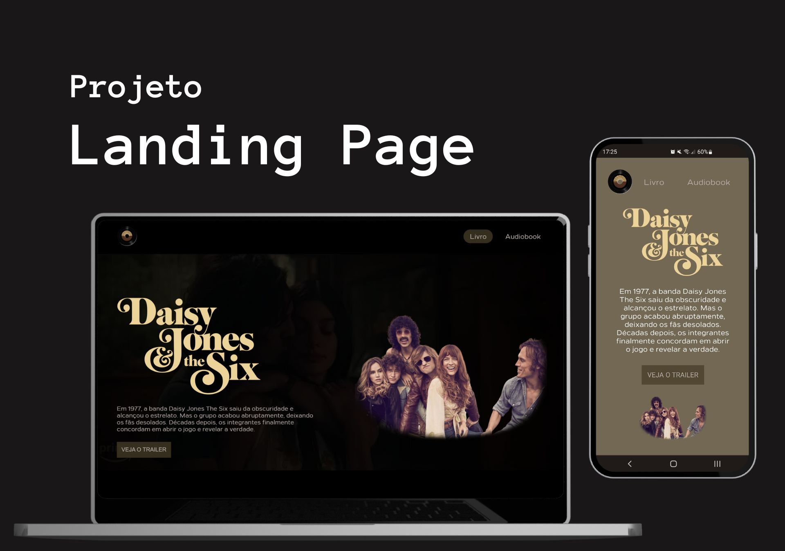

  

## 💻 Projeto

A ideia do projeto era criar de uma landing page para divulgar a nova série do Prime Vídeo, Daisy Jones & The Six, com links para o trailer da série, além de links para a compra do livro e do audiobook em que a série foi baseada.

O projeto foi feito durante a semana de imersão de programação realizado pelo <a href="https://devemdobro.com/matriculas-abertas/">Dev Em Dobro</a>. 

## 🚀 Tecnologias

- HTML e CSS
- JavaScript
- Git e Github